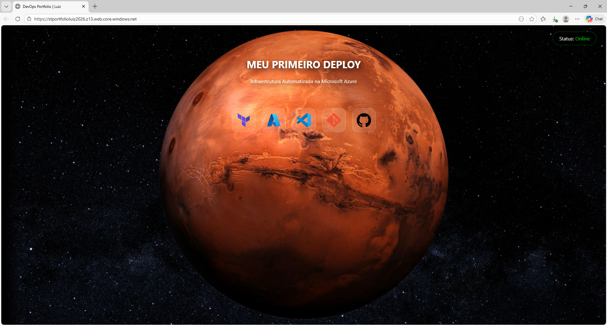

# 🚀 Portfólio DevOps Infrastructure as Code (IaC)

Este projeto demonstra o provisionamento automatizado de um site estático na **Microsoft Azure** utilizando **Terraform**. O objetivo é exibir um dashboard interativo que detalha as tecnologias e os logs do processo de deploy.

## 🔗 Link do Projeto
👉 **[Visualize o site rodando aqui](https://stportfolioluiz2026.z13.web.core.windows.net/)**

---

## 🛠️ Tecnologias Utilizadas
* **Terraform**: Automação da infraestrutura (IaC).
* **Microsoft Azure**: Hospedagem via Storage Account & Static Website.
* **Git/GitHub**: Controle de versionamento.
* **HTML5/CSS3/JS**: Interface interativa com Glassmorphism.

---

## 📐 Arquitetura
O Terraform gerencia os seguintes recursos:
1. **Resource Group**: Organização dos ativos na Azure.
2. **Storage Account**: Armazenamento dos arquivos.
3. **Storage Blobs**: Upload automatizado de HTML, CSS e imagens.
4. **Static Website**: Ativação do endpoint de hospedagem.

---

## 📸 Demonstração


---

## 🚀 Como replicar este projeto
1. Instale o [Terraform](https://www.terraform.io/).
2. Configure suas credenciais da Azure via Azure CLI (`az login`).
3. Clone este repositório:
   ```bash
   git clone [https://github.com/luizhf-ribeiro/meu-primeiro-projeto-devops.git](https://github.com/luizhf-ribeiro/meu-primeiro-projeto-devops.git)